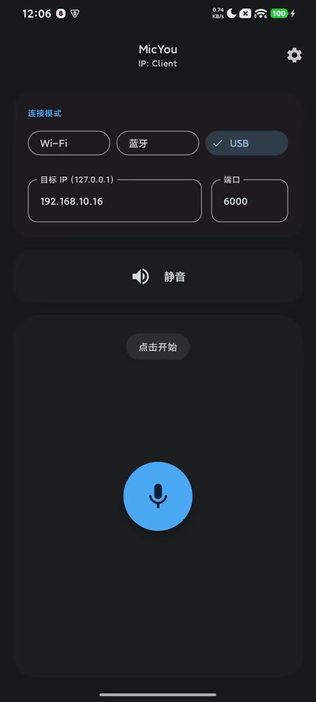
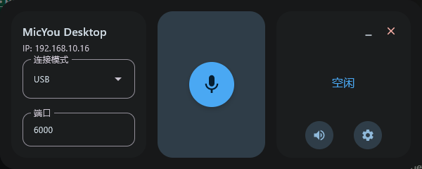

# MicYou

<p align="center">
  
</p>

<p align="center">
  <a href="./README_ZH.md">简体中文</a> | <a href="./README_TW.md">繁體中文</a> | <b>English</b>
</p>

MicYou is a powerful tool that turns your Android device into a high-quality wireless microphone for your PC. Built with Kotlin Multiplatform and Jetpack Compose/Material 3.

Based on the [AndroidMic](https://github.com/teamclouday/AndroidMic) project.

## Features

- **Multiple Connection Modes**: Support for Wi-Fi, USB (ADB/AOA), and Bluetooth.
- **Audio Processing**: Built-in Noise Suppression, Auto Gain Control (AGC), and Dereverberation.
- **Cross-Platform**:
  - **Android Client**: Modern Material 3 interface, dark/light theme support.
  - **Desktop Server**: Receive audio on Windows/Linux.
- **Virtual Microphone**: Works seamlessly with VB-Cable to act as a system microphone input.
- **Customizable**: Adjust sample rate, channel count, and audio format.

## Screenshots

### Android App
|                        Main Screen                        |                           Settings                            |
|:---------------------------------------------------------:|:-------------------------------------------------------------:|
|  |  |

### Desktop App


## Getting Started

### Android
1. Download and install the APK on your Android device.
2. Ensure your device is on the same network as your PC (for Wi-Fi) or connected via USB.

### Windows
1. Run the desktop application.
2. Configure the connection mode to match the Android app.

### macOS

> [!IMPORTANT]
> If you are using an Apple Silicon Mac, Bluetooth mode cannot be used without Rosetta 2 translation.

To ensure your experience, you need to install some dependencies via Homebrew:

~~~bash
brew install blackhole-2ch --cask 
brew install switchaudio-osx --formulae
~~~

**BlackHole must be installed**. If you don't have Homebrew, go to https://existential.audio/blackhole/download/ to download the installer. Regardless of whether you install via Homebrew or the installer, please restart after installation.

After downloading the app from [GitHub Releases](https://github.com/LanRhyme/MicYou/releases) and installing it in your Applications folder, Gatekeeper may block it during first use.

If prompted with “Untrusted Developer,” navigate to **System Settings/System Preferences -> Privacy & Security** to allow the app to run.

If prompted with “The application is damaged,” resolve it by executing the following command:
~~~bash
sudo xattr -r -d com.apple.quarantine /Applications/MicYou.app
~~~

### Linux

#### Using pre-built packages (recommended)
Pre-built packages are available in [GitHub Releases](https://github.com/LanRhyme/MicYou/releases).

**DEB package (Debian/Ubuntu/Mint etc.):**
```bash
# Download the .deb package from GitHub Releases
sudo dpkg -i MicYou-*.deb
# If dependencies are missing:
sudo apt install -f
```

**RPM package (Fedora/RHEL/openSUSE etc.):**
```bash
# Download the .rpm package from GitHub Releases
sudo rpm -i MicYou-*.rpm
# Or use dnf/yum:
sudo dnf install MicYou-*.rpm
```

**AUR (Arch Linux and derivatives):**
```bash
# Clone the AUR repo and install the package
git clone https://aur.archlinux.org/micyou-bin.git
cd micyou-bin
makepkg -si

# Or use an AUR helper like paru/yay
paru -S micyou-bin
```

**Run the application:**
```bash
# After installation, you can run MicYou from your application menu
# Or from terminal:
MicYou
```

> [!TIP]
> Having issues? Check out the [FAQ](./docs/FAQ.md)

## Building from Source

This project is built using Kotlin Multiplatform.

**Android app (APK):**
```bash
./gradlew :composeApp:assembleDebug
```

**Desktop application (run directly):**
```bash
./gradlew :composeApp:run
```

**Build packages for distribution:**

**Windows installer (NSIS):**
```bash
./gradlew :composeApp:packageWindowsNsis
```

**Windows ZIP archive:**
```bash
./gradlew :composeApp:packageWindowsZip
```

**Linux DEB package:**
```bash
./gradlew :composeApp:packageDeb
```

**Linux RPM package:**
```bash
./gradlew :composeApp:packageRpm
```

## Star History

[](https://star-history.com/#lanrhyme/MicYou&Date)
